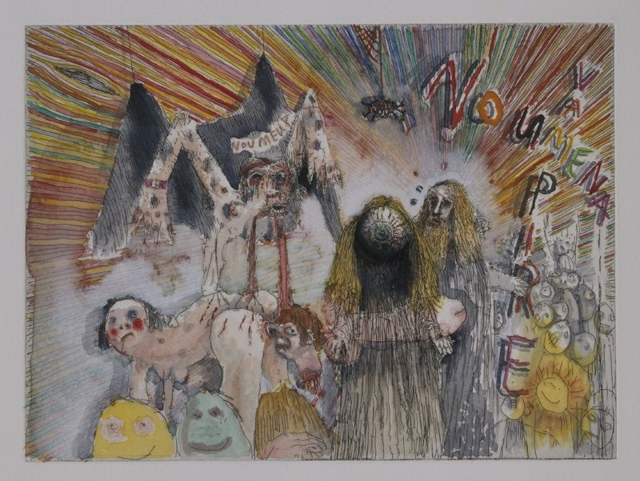

- L’accélérationnisme est un continuum idéologique
- Propose que le processus sociaux ( la croissance capitaliste et le changement technologique soit intensifiés de manière drastique afin de déstabiliser le systèmes pour créer un nouveau changement social radical appelé «l’accélération»
	- Soutient l’intensification indéfinie du capitalisme[^34]et de ses structures ainsi que les conditions d’une singularité technologique, un point hypothétique dans le temps où la croissance technologique devient incontrôlable et irréversible:
	  
	  *«Alors que les blockchains, la logistique des drones, les nanotechnologies, l’informatique quantique, la génomique computationnelle et la réalité virtuelle déferlent, immergées dans des densités d’intelligence artificielle toujours plus élevées L'accélérationnisme n’ira nulle part»*
	  
	  *Nick Land*
	  
	  Post-Marxiste:  Suit l’idée que les contradictions et les instabilités internes du capitalisme compromettront sa croissance, et que par conséquent l’abolition du système et de ses structures de classe pourrait être provoquée par son accélération
- Déterritorialisation: Processus par lequel une relation sociale, un « territoire » subit une modification, une mutation ou une déconstruction de son organisation et de son contexte actuels. Les éléments constituent alors un nouveau territoire, ce qui est le processus de « re-territorialisation»
- Nick Land: le capitalisme n’a jamais été correctement libéré, mais qu’il avait toujours été freiné par la politique
- ### Artiste influencé..e par L'accélérationnisme:
- Jake & Dinos CHAPMAN: Artiste contemporain connu notamment pour les scandales qu’ils engendrent – membre de la Young British Artist[^35] (Damien HIRST – Gary HUME...) avec d’autres artistes anglais..es qui sont plus ou moins scandaleux..ses.
	- Portant un attrait pour le dégoût et l’horreur les frères CHAPMAN ne croit pas au progrès ni au passé.
		- On retrouve leurs peintures [*Disasters of War IV*](https://jakeanddinoschapman.com/works/disasters-of-war-iv/)  sur la couverture du livre [*Fanged Noumena: Collected Writings 1987-2007*]  (https://en.wikipedia.org/wiki/Fanged_Noumena:_Collected_Writings_1987-2007) de Nick LAND
			- En référence au ((7d086422-be2d-4e96-952d-82eb8c64c998))
	- On peut retrouver plusieurs écrits de Jake CHAPMAN édités par la maison d’édition [*Urbanomic*](https://www.urbanomic.com/) – maison d’édition par laquelle passe de nombreux textes accélérationnistes ou du CCRU
	- Une de leur œuvre [*Zygotic Acceleration, Biogenetic, De sublimated Libidinal Model (Enlarged X 1000)*](https://jakeanddinoschapman.com/exhibitions/zygotic-acceleration-biogenetic-de-sublimated-libidinal-model-enlarged-x-1000victoria-miro-gallery-london/8243/)   emprunte dans son titre des termes développés par le CCRU: Zygotic
		- En réponse à la question de la télépathie dans leurs corps jumeaux en se référant au neurologue Paul MOBIUS.[^36]
		- Maia DAMIANOVIC[^37]à demandé à Jake et Dinos CHAPMAN s'ils "essayent de structurer un mode de communication télépathique qui brouille la barrière psychique entre l'intérieur et l'extérieur et remet l'être en question ? Dans le cadre de la conférence [[Activist Neuroaesthetics]]
		- Il y a une dimension télépathique à l'être dans cette fluidité entre intériorité et extériorité, et dans le dédoublement, le dédoublement et la multiplication des organes, qui a aussi préséance chez les CHAPMAN. Les CHAPMAN abordent la question de la télépathie en termes de bande de MOBIUS, un dispositif de déjà-vu sans fin qu'ils rendent comme un psycho-soma extrême. Leur travail avec des mannequins incarne l'horreur et la violence du capitalisme zombie, la publicité virale et la contagion de la pensée et de l'être corporatif conjoints et « incorporés ». Jake et Dinos CHAPMAN dialoguent avec le réalisme étrange et les idées technocultes de Mark FISHER, qui a aidé à développer le terme hyperstition.
- CCRU : [Cybernetic Culture Research Unit](http://www.ccru.net/index.htm) :
	- Groupe de recherche interdisciplinaire expérimental à l’université de Warwick dans les années 1990 > définit ces centres d’intérêts :
	  
	  *«cinéma complexité monnaies , dance music, e cash, cryptage féminisme , fiction, images, vie inorganique , marchés , matrices, micro-biotique multimédia réseaux , chiffres, perception, reproduction, sexe , simulation, télécommunications , textes , commerce, vidéo virtualité »*
- Développe un label de jungle:
  *«Jungle fonctionne comme un accélérateur de particules , des fréquences sismiques de basse génèrent un drone cellulaire qui immerge le corps... rembobine et recharge le temps conventionnel en blips de vitesse en silicium .... Ce n'est pas seulement de la musique . Jungle est le diagramme abstrait du futur inhumain planétaire»*
- Juliette BONNEVIOT: [Mitchell #2](http://dismagazine.com/blog/73613/xpo-gallery-presents-les-oracles/), 2010 
	- Des peintures rappelant les pochettes des albums de drum’n’bass à la base générés en 3D présentant des longs paysages et des formes géométriques volantes.