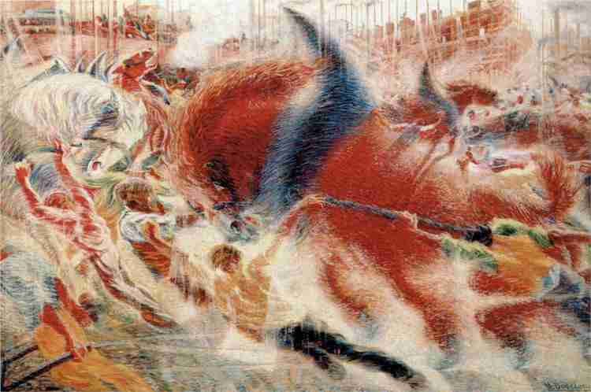

- Le futurisme se développe aussi en Russie avec Davidovich BURLIUK qui en rédige un manifeste
- Prônant la modernisation et la culture du rajeunissement
- Orienter vers les réalités sociales russes de l’après première guerre
- De nombreuse femmes forment le mouvement
	- Nathalie GONTCHAROVA
	- Lioubov POPOVA
- Son influence c’est étendu plus tard dans le cinéma et les formes graphique de la propagande russe
- Suit notamment les manifestes de l’art des bruit de RUSSOLO
	- Arseny AVRAAMOV: [*Symphonie pour sirène*](https://jan-m.org/symphony-of-sirens/), 1922
		- Commémore une révolution social a travers une œuvre social qui ferait participer tout le monde
			- A travers une œuvre de bruit ou les éléments de la ville joue en simultané
- 