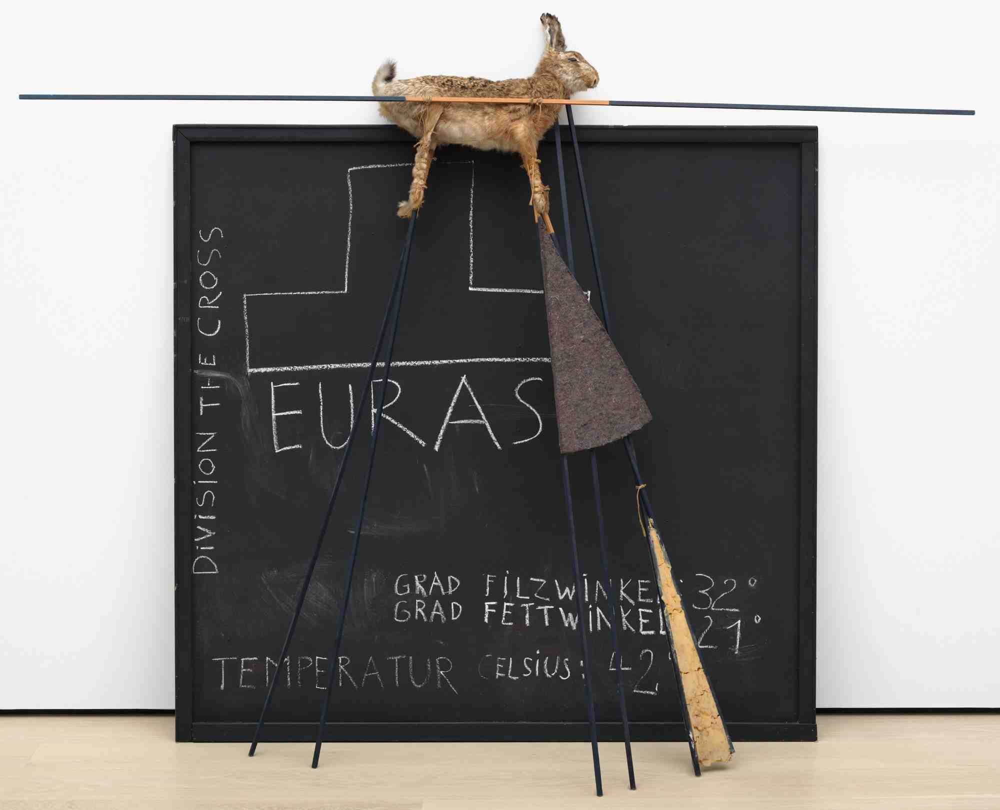
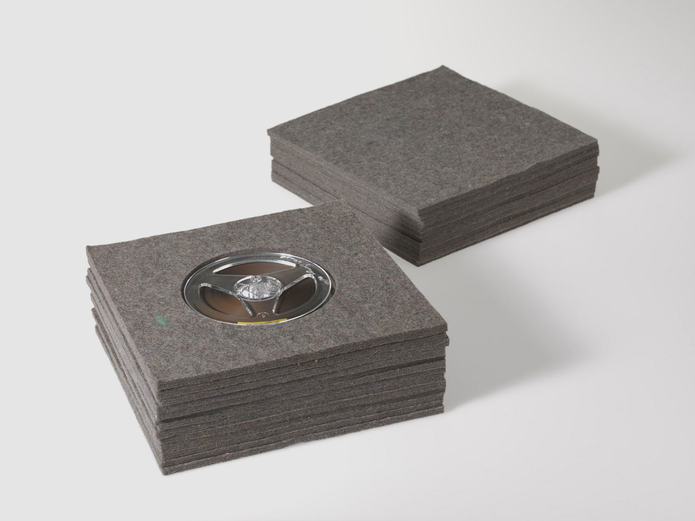
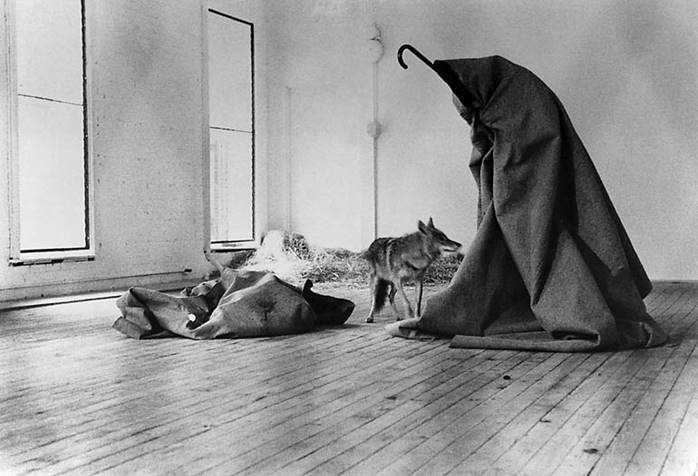
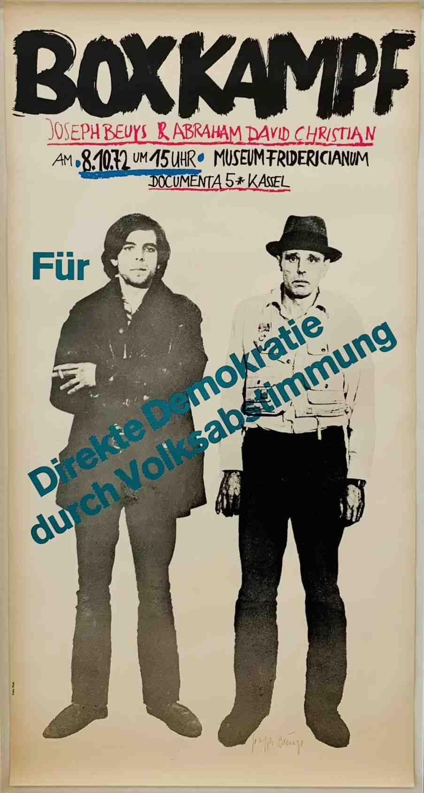
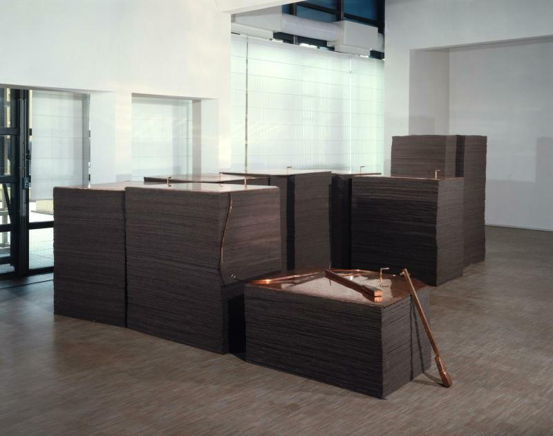
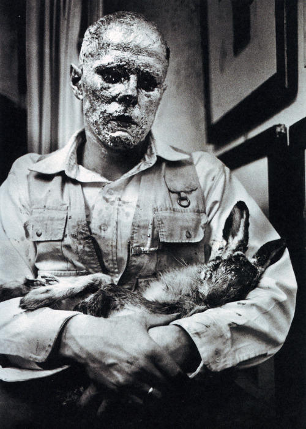
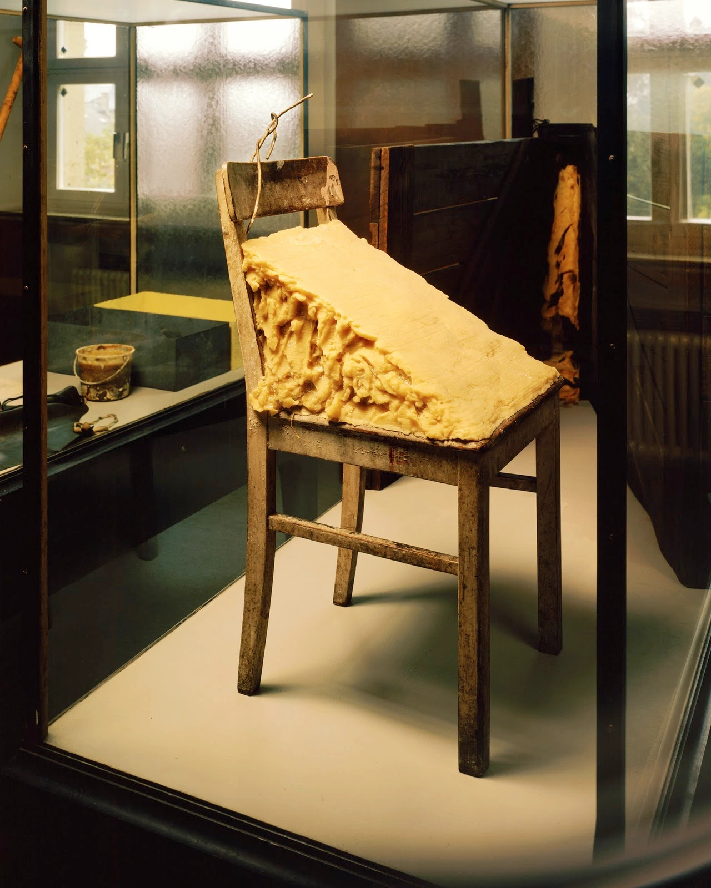
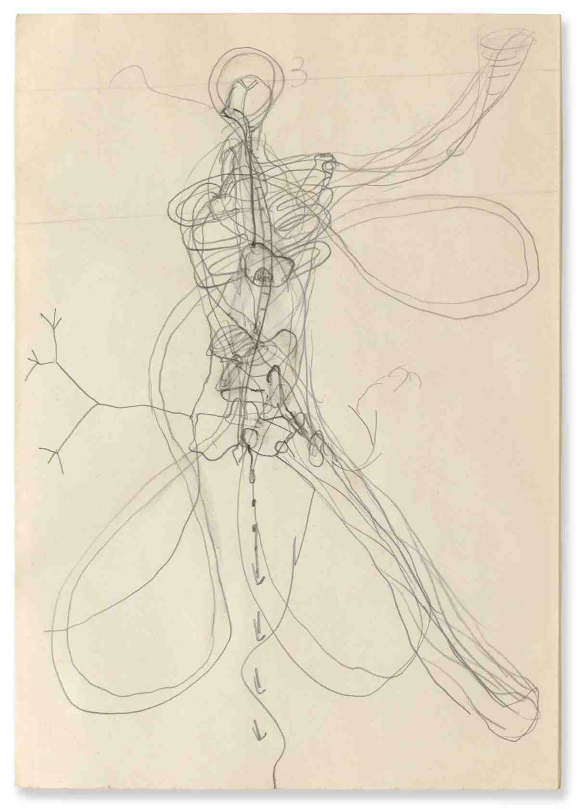
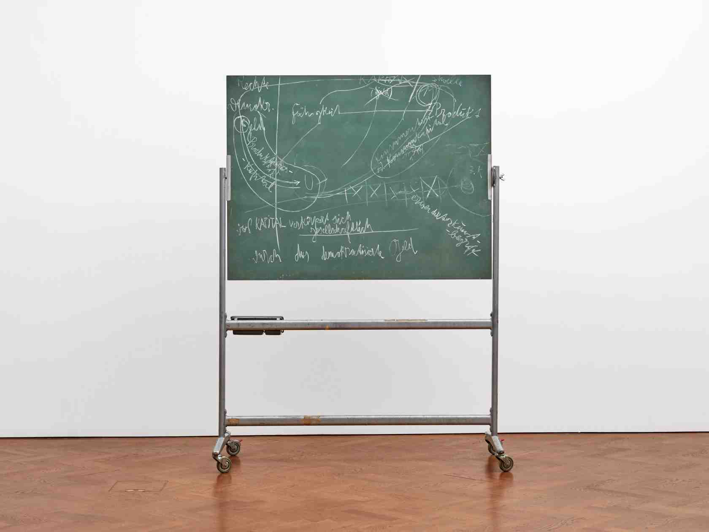
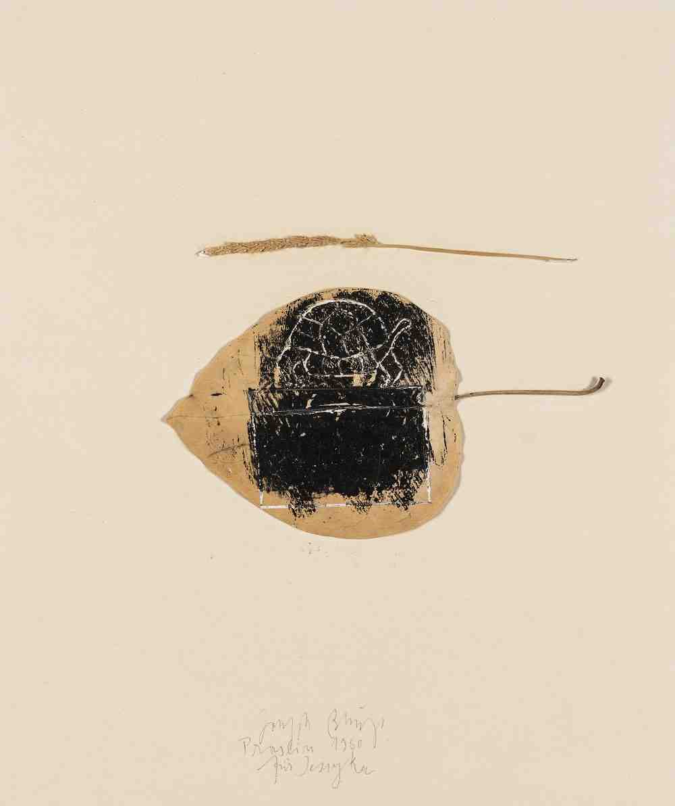

## Joseph Beuys and [[Fluxus]]
- L’artiste programme la « Festum Flexorum » dans son école à Académie des beaux-art de Düsseldorf en février 1963 et reprenant à son compte certains aspects du groupe, comme dans l’exposition de près de 250 œuvres qu’il organise à Kranenburg qu’il qualifie de « Josef Beuys Fluxus »
	- Joseph Beuys : *La Symphonie Sibérique*, 1963 
	  id:: 653d3a15-b31d-4773-b62c-3e8e7c6e140f
		- Première action Fluxus à Académie des beaux-art de Düsseldorf, débutait par un solo de piano. Alors qu’était diffusée une pièce de Satie, Beuys suspendait un lièvre mort à un tableau noir. Sur le piano étaient placés de petits tas d’argile sur lesquels étaient plantées des branches. Un fil de fer servant de conducteur reliait le piano au lièvre, dont le cœur était enlevé par l’artiste. 
		            « Je veux exprimer une relation signifiante pleine de contenus concernant la naissance et la mort ; la conversion en matière, du lièvre qui apparaît ici, réellement, pour la première fois, dans ce concert. Cela n’a rien à voir avec ces actions [[Néo Dada-Organizers]] pour effrayer le bourgeois »
		- La distance qui s’est rapidement installée entre Beuys et [[Fluxus]] s’explique peut-être par le fait que le rapport au public, pour les artistes du regroupement, passait en partie par la scène et la représentation (malgré une évidente mise à mal des aspects spectatoriaux), tandis que les « actions1 » de Beuys visaient une dimension symbolique totale et thérapeutique, en vue d’une régénération du monde
		- Cette volonté de distinction rejoint la singularité de son projet social, dépassant le champ de l’art qu’il faut selon lui renouveler
		- La Symphonie Sibérique,
- ## [[Sculpture sociale]]
- ## ((65480be3-ae39-4240-a604-b56eee2fa153))
- ## Actions
- Intègre des activités quotidienne au contexte artistique
- Joseph Beuys : Yes Yes Yes Yes Yes No No No No 
  id:: 653e63b1-7bb1-4d3f-8193-75a786d31e82
- À l'intérieur d'une pile de 20 plaques de feutre se trouve une bobine de ruban adhésif sur laquelle BEUYS prononce un interminable monologue « Ja Ja Ja Ja Ja, Nee Nee Nee Nee Nee » – un énoncé familier dans le dialecte rhénan s'appliquant à tout et à rien – fonctionne ici, sans mélange, comme un symbole ironique de la dialectique irrévocable de la vie quotidienne.
- L’action rompt avec le marché de l’art moderne dans laquelle il évolue
	- Joseph Beuys : I like America and America likes Me, 1986 
		- Il s’isole pendant 3 jour dans une cage en verre dans la galerie de René BLOCK à NY enferme avec:
			- Un coyote: Symbole de la part sauvage du continent américain
			- Une grande couverture de feutre: Symbole d’isolement
			- Dispose sur le sol des unes du Wall Street Journal > Représente la puissance économique américain
			- Réconcilier symboliquement la société occidentale avec cet animal, sacré pour certaines populations amérindiennes, et incarner la rencontre entre l’homme moderne et une spiritualité perdue
- Lors de la Documenta de 1972 Beuys avait installé un bureau d’information d’Organisation pour la démocratie directe par référendum. Lors de débat fort animés son élève Abraham Christian Moebus l’invita à un combat de boxe pour la démocratie directe. Le match aura lieu le dernier jour de l’exposition > Boxkampf für die direkte Demokratie, 1972 {:height 32, :width 500}
	- Un autre élève Anatol Herzfeld était arbitre et proclama Beuys vainqueur au point pour la démocratie direct grâce à ses directs.
- Beuys a souvent intégré la boxe comme principe esthétique. Pour l’artiste l’art est une activité politico-sociale global, un échange permanent d’énergie et de coups entre des personnes appartenant..es à une même société qui se sentent unies.
- ### Energie
- L’énergie apparait pour l’artiste comme un potentiel une possibilité de création
	- Travaille souvent avec la chaleur humaine - l’amour:
		- Mène du chaos à la forme, De la pensé à la volonté
		  id:: 653d3428-9031-4cb0-b302-a70fd19a5aec
	- Beuys identifie le chaos à la chaleur et à la force de l’évolution
	   Le froid lui est identifier à la rigueur intellectuelle 
	  Dans sa théorie de la plastique ( Theorie der Plastik )
		- Énergie non dirigée ( chaleur chaos )
			- Joseph BEUYS: Fonds VII/2  
			  id:: 653d3440-3a15-4764-a08b-ac161825b58b
			- piles de feutre surmontées d’une plaque de cuivre  le feutre (chaleur) et le cuivre électricité forme deux des principe constitue de la vitalité des œuvres de l’artiste dans sa conception d’œuvre vivante
- ### Matériaux
- Comment expliquer les tableaux à un lièvre mort {:height 708, :width 500}
	- Le lièvre n’est pas que l’animal
		- Il est l’incarnation d’un principe vitale
			- Creusé un terrier au sol pour BEUYS ce que l’homme où la femme accomplissent avec leurs pensées: se frotter à la matière
- Chaise avec graisse, 1963 
	- La graisse aussi est une matière qui incarne la transformations des états de sa matière
	- Sensible à la chaleur vient à fondre et à changer d’états
- Luge en bois, feutre, torche éclectique, sangle, graisse, 1969
	- Le feutre est un isolement ((653d3440-3a15-4764-a08b-ac161825b58b))
	- Le cuivre un conducteur électricité et donc de chaleur
- ### Le dessin Chez Beuys – Impulse Drawing
- A travers l’acte physique il utilise le dessin comme moyen de cristalliser sa pensée conceptuelle. Et non comme des études de matériaux préparatoire à des projets sur d’autres support.
	- Il affirma la fonction du dessin en tant que domaine générateur de la réflexion profonde de l’artiste sur la nature de l’art
		- Joseph Beuys : Bewegung Rhythmus, 1962 
		  id:: 653e63b1-e2a9-4714-b3bb-d75b22d57e18
			- Combinant des éléments figuratif et abstrait la nature de l’aquarelle est ambiguë.
			  Les flèches présentes font écho au principe d’énergie que l’artiste a théorisé et conceptualisé dans de nombreuses œuvres.
- Utilisant notamment des tableaux noirs qu’il utilisait lors de conférence ou de cours où il y dessinait dans le but de communiquer avec autrui.
	- Joseph Beuys : Ökologie und Sozialismus [Ecology and Socialism], 1980 
	  id:: 653d3a15-94b4-41fb-a748-0fa60dacf0ac
		- Estimant que les systèmes graphiques étaient capable de transmettre des concept d’une manière qui transcendait les limites de l’expression linguistique
- On y retrouve des constantes notamment dans les intérêts et les considérations de l’artiste pour certains sujets
	- Les sciences naturelles étant une passion que l’artiste avait se retrouve dans de nombreux dessins
		- Joseph Beuys : Untitled, 1980 