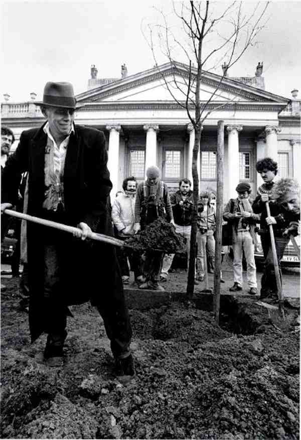

- Il s’agissait pour lui de modifier les consciences, au travers d’actions et de conférences spectaculaires. C’est dans une formulation mystique de l’action artistique que BEUYS conçoit le message symbolique qu’il veut livrer au monde.
- L’important, à ses yeux, était d’abord de saisir la dimension profondément humaine de l’œuvre et de se détacher des vanités de l’artiste dans le monde de l’art, tout en maîtrisant la symbolique et l’importance des matériaux dans le processus créatif
- Encadrée et menée à bien par des artistes, la sculpture sociale aurait mobilisé la créativité latente de tout individu en vue de modeler la société de l’avenir (« le seul acte plastique véritable, consiste dans le développement de la conscience humaine »). La « sculpture sociale » excède par conséquent les concepts traditionnels de l’art, délaissant les principes esthétiques formels au profit de processus de perception et de cognition, appelant à la participation de chacun..e pour un changement de société.
- ## La pédagogie de Beuys
  id:: 65480be3-ae39-4240-a604-b56eee2fa153
- L’une des conceptions fondamentales de beuys dans son engagement artistique est celui de Rudolf Steiner
	- Il pose le principe de la liberté comme but suprême de la société. Rudolf Steiner est le fondateur de l’anthroposophie
		- Cette philosophie que partage Beuys le situe dans la lignée du grand romantisme allemand. Il partage le rêve de l’art en tant qu’éducation, une pratique qui tend vers le social pour atteindre et transformer chacun, en vue d’une intention libertaire.
		- Tel est le projet de la sculpture sociale, où le concept élargi de l’art, visant au changement des consciences humaines.
		- Pour Beuys cette aspiration au changement mène à une forme de régénération
		- Le processus de la Sculpture Sociale s’opère parallèlement au conflit déclenché entre l’artiste et l’Académie de Düsseldorf dans laquelle il enseigne.
			- Il créa de nombreux parti2 pour défendre les personnes ayant trouvées un refus de la part de l’académie à recevoir un enseignement artistique.
				- Le refus allait à l’encontre de Beuys pour qui l’enseignement artistique devait être donner à tout le monde.
				  id:: 65480be3-9bdd-4394-83a2-5ee4494b5e39
- L’art de Beuys, thérapeutique et régénératif, est un art politique au sens philosophique du terme, parce qu’il participe aux débats et à l’élaboration de la société.
	- Aux yeux d’Arendt, l’artiste est un personnage politique en ce qu’il revêt les qualités nécessaires à l’action politique, ou plus exactement à la « praxis » politique (la praxis, au sens d’action, désigne l’ensemble des activités humaines susceptibles de transformer le milieu naturel ou de modifier les rapports sociaux).
		- Par la parole et par l’action, l’artiste permet une expérience de liberté qui génère un dialogue avec autrui.
			- Beuys, en aspirant à étendre le champ de l’art à toutes les dimensions de l’existence, entend créer les conditions d’une expérience de liberté par le potentiel de création.
		- Beuys a contribué à la création du partie les Grüne
			- [[Joseph Beuys]] : 7000 chênes, 1982 - 1986 
			  id:: 653e63b1-925e-43e6-a815-551ac22c526b
				- Cette action initiée en 1982 durera plusieurs années, elle se poursuivra après la mort de l’artiste en 1986 et se répandra à travers la planète. À chaque chêne est associée une colonne de basalte. Ces 7000 colonnes forment au début de l’opération un tas, visible dans un parc de Kassel2.
				- *Mon intention, c’est que la plantation des chênes n’est pas seulement une action de la nécessité de la biosphère, c’est-à-dire dans un contexte purement matériel et écologique, mais que ces plantations nous conduisent à un concept écologique beaucoup plus vaste – et cela sera de plus en plus vrai au cours des années, parce que nous ne voulons jamais arrêter l’action de plantation. La plantation de 7000 chênes est seulement un début symbolique et pour ce début symbolique, j’ai aussi besoin de cette pierre témoin, d’où cette colonne de basalte. Cette action doit donc montrer la transformation de toute la vie, de toute la société, de tout l’espace écologique*
				  id:: 65d37714-6152-436e-aab1-58a402bcbdb4
	- Son engagement pédagogique et son intérêt pour la pluridisciplinarité ou pour la conception systémique du savoir trahit une conception de l’apprentissage assez proche de celle d’autres personnalités [[Fluxus]] .
		- En 1970 il contribue avec [[John Cage]] , Kaprow, Brecht et Patterson à l’ouvrage publié par Filliou, Teaching and Learning as Performing Arts, dans lequel l’artiste de la Création Permanente élargit sa conception de l’art à une vision globale de la société, inspirée de Charles Fourier.
			- Rejetant les idées d’admiration et de spécialisation qui sont pour lui responsables de l’aliénation de la société capitaliste, Filliou distingue une « économie de la prostitution », reposant sur la quête du pouvoir, d’une « économie poétique » chargée d’instaurer un nouveau système de valeurs plus propice à l’épanouissement de l’homme.